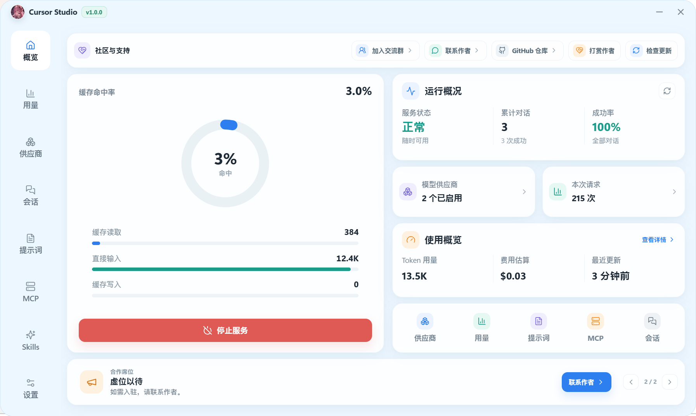
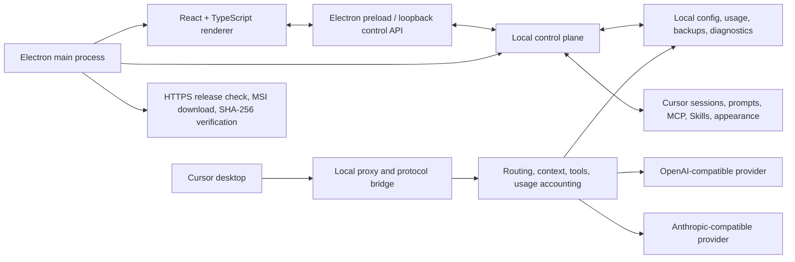

# Cursor Studio

<p align="center">
  
</p>

<p align="center">
  <strong>A local-first Windows desktop control center for Cursor.</strong><br>
  Manage model providers, understand usage and cost, and maintain Cursor sessions, prompts, MCP servers, Skills, appearance, and integration settings from one application.
</p>

<p align="center">
  <a href="README.md">English</a> | <a href="README.zh-CN.md">简体中文</a>
</p>

<p align="center">
  <a href="https://github.com/DearLicy/cursor-studio/releases/latest"></a>
  <a href="https://github.com/DearLicy/cursor-studio/releases/latest"></a>
  
  
  <a href="LICENSE"></a>
</p>

<p align="center">
  <a href="https://github.com/DearLicy/cursor-studio/releases/latest"><strong>Download the latest Windows MSI</strong></a>
</p>

> [!NOTE]
> Cursor Studio is an independent community project. It is not affiliated with, endorsed by, or sponsored by Cursor or Anysphere.



## Why Cursor Studio?

Cursor is most useful when its model connections and personal workflow are dependable. Cursor Studio turns the files, settings, credentials, usage records, and integrations behind that workflow into a coherent desktop experience.

- **One control surface:** providers, routing, usage, conversations, prompts, MCP, Skills, visual customization, backups, and diagnostics live in one application.
- **Provider-friendly compatibility:** use OpenAI-compatible or Anthropic-compatible services, select Chat Completions or Responses for OpenAI providers, discover models, and test connectivity without hand-editing Cursor files.
- **Base URL that behaves as expected:** both `https://www.akucb.com` and `https://www.akucb.com/v1` work. Cursor Studio normalizes the terminal `/v1` segment and avoids duplicated paths such as `/v1/v1/models`.
- **Balance with no extra account setup:** for New API and Sub2API, Cursor Studio detects the platform and reads balance data using the provider's existing Base URL and API key.
- **Honest cost controls:** model pricing snapshots and a per-provider cost multiplier make estimated spend match reseller or organization-specific pricing while leaving upstream billing untouched.
- **Cursor-native workflow management:** inspect local sessions, maintain prompt rules, probe MCP servers, and discover or install Skills from their real Cursor locations.
- **Local-first ownership:** configuration and usage history stay under your Windows user profile. No Cursor Studio cloud account is required.
- **Recoverable changes:** configuration snapshots, Cursor settings backups, appearance restoration, diagnostics, and verified MSI updates are built into the product.
- **English and Simplified Chinese:** the first launch follows the operating system; use the icon menu immediately to the left of the window controls to choose English or 简体中文, with the preference saved automatically.

## Feature Tour

| Area | What it provides |
| --- | --- |
| **Overview** | Service state, request and token totals, cache effectiveness, success rate, estimated cost, provider balance summaries, update status, and support links. |
| **Providers** | OpenAI-compatible and Anthropic-compatible connections, model discovery, default model selection, model enablement and favorites, context/output limits, reasoning effort, per-model prices, health checks, failover priority, balance lookup, and provider cost multiplier. |
| **Usage** | Ranges for 24 hours, 7/30/90 days, or all history; token/request/cost trends; provider distribution; cache breakdown; activity heatmap; model ranking; status/source/provider/model filters; searchable request detail; CSV export; and local-history cleanup. |
| **Sessions** | Read Cursor's local conversation index, browse by recent activity or project, inspect messages, search, paginate, delete selected sessions, and clean empty sessions and their files. |
| **Prompts** | Built-in and custom prompt library, search, copy, edit, enable/disable, append or replace injection modes, conflict detection, and synchronization to Cursor-managed rules. |
| **MCP** | Read and update Cursor's MCP configuration, import server JSON, probe stdio and HTTP/SSE transports, inspect discovered tools, review probe state, and remove entries. |
| **Skills** | Discover global and workspace `SKILL.md` entries, inspect or edit writable Skills, create and remove local Skills, add GitHub repositories, install discovered Skills, and check managed installations for updates. |
| **Settings** | Local routing and proxy state, certificate status, Cursor connection controls, configuration import/export, three-snapshot backup retention, diagnostics export, appearance controls, and Cursor profile/context settings. |
| **Appearance** | Image or video backgrounds, opacity, blur, surface transparency, sizing, blend modes, random folders, timed rotation, live preview, Cursor injection, and backup-based restoration. |
| **Updates and language** | In-app release checks, download progress, SHA-256 verification, MSI installation/restart, an OS-language default, and a persistent English/简体中文 preference. |

## Installation

### Requirements

- Windows 10 or Windows 11, x64
- Cursor desktop installed for Cursor integration, session, MCP, Skills, prompt, and appearance features
- Internet access for model providers and optional online functions such as release checks, pricing refreshes, and GitHub Skill sources

### Install the release build

1. Open the [latest release](https://github.com/DearLicy/cursor-studio/releases/latest).
2. Download `Cursor Studio.msi`.
3. Run the installer, then start Cursor Studio from the Start menu or desktop shortcut.

The MSI installs per user by default. Some Cursor appearance operations may ask you to close Cursor or run Cursor Studio with elevated permissions because they update files inside the Cursor installation directory.

## Quick Start

1. Open **Providers** and add a provider.
2. Choose **OpenAI Compatible** or **Anthropic Compatible**, then enter a display name, Base URL, and API key.
3. For an OpenAI-compatible provider, select **Chat Completions** or **Responses**. Set a cost multiplier if the provider bills above or below the base model price.
4. Fetch the model list, enable the models you want, select a default, and save.
5. Save the provider. Cursor Studio automatically detects New API or Sub2API and shows the balance in the provider list.
6. Open **Settings > Proxy Settings**, start/connect the local service, and follow the certificate prompt if the selected connection flow requires it.
7. Reload or restart Cursor. Requests routed through Studio will begin appearing on **Overview** and **Usage**.

## Provider Configuration

### Supported API shapes

| Provider type | Requests | Model discovery |
| --- | --- | --- |
| OpenAI compatible | `/v1/chat/completions` or `/v1/responses` | `/v1/models`, with `/models` compatibility fallback |
| Anthropic compatible | `/v1/messages` | `/v1/models` |

The OpenAI endpoint choice applies to all models under that provider. When a compatible Responses endpoint returns `404` or `405`, the runtime can fall back to Chat Completions for compatibility.

### Base URL normalization

Enter the deployment root or its terminal `/v1` form. Both are supported:

```text
https://www.akucb.com
https://www.akucb.com/
https://www.akucb.com/v1
https://www.akucb.com/v1/
```

All four forms resolve to the same site root for platform endpoints and the correct versioned path for model requests. A path prefix is preserved, so a deployment such as `https://example.com/gateway/openai/v1` remains under `/gateway/openai`.

Use a Base URL rather than a full leaf endpoint such as `/v1/chat/completions`.

### Automatic New API and Sub2API balance

Balance lookup uses the Base URL and API key already stored on the provider. There is no separate dashboard token, user ID, balance URL, or provider-type selector to configure.

The provider directory shows only the remaining amount. It loads automatically, and running the latency test also refreshes the balance with the Base URL and API key currently being tested.

Cursor Studio probes the following authenticated endpoints in order:

| Platform | Purpose | Endpoint |
| --- | --- | --- |
| New API | Identify the platform and read token quota | `GET {siteRoot}/api/usage/token/` |
| Sub2API | Identify the API-key billing schema | `GET {siteRoot}/v1/sub2api/billing` |
| Sub2API | Read available/used quota or unrestricted status | `GET {siteRoot}/v1/usage` |

Requests use `Authorization: Bearer <API_KEY>`. New API quota values follow the conventional New API display conversion of 500,000 quota units per US dollar. Sub2API's billing response is used as a platform discriminator, while the adjacent usage response supplies the displayed balance.

Balance lookup depends on the server implementing one of these compatible response schemas. A generic OpenAI-compatible proxy may serve models successfully without exposing a balance endpoint.

### Pricing and provider multiplier

Cursor Studio estimates request cost from the matched model pricing catalog or the prices configured for an individual model. The provider multiplier is then applied on the Usage page:

While the desktop app is running, a background monitor checks latency for enabled, fully configured providers and refreshes the models.dev pricing catalog every 10 minutes. Scheduled observations update status without incrementing routing circuit-breaker failures.

```text
displayed cost = estimated base model cost × provider cost multiplier
```

Examples:

| Multiplier | Meaning |
| ---: | --- |
| `1.00` | Display the base estimate |
| `1.25` | Add a 25% reseller/organization markup |
| `0.80` | Apply a 20% discount |
| `0` | Report zero displayed cost for that provider |

The multiplier accepts any finite value greater than or equal to `0`; invalid or negative values fall back to `1`. It is reporting-only: it does not alter provider requests, API parameters, account quota, or upstream invoices. Usage queries recalculate stored records with the provider's current multiplier, so changing it also updates historical totals associated with that provider.

## Usage Accounting

Cursor Studio records requests that pass through its local runtime and tracks:

- input, output, cache-read, cache-write, and total tokens;
- provider, model, request source, status, latency, and error summary;
- pricing source and the price snapshot used for the estimate;
- multiplier-adjusted cost in US dollars.

Use **Export CSV** to export the active date/provider/model/source filter. Clearing usage removes the locally stored usage summary and recent request details; it does not change provider-side billing records.

Cost values are estimates. Provider invoices and balance endpoints remain the source of truth, especially when a service applies tiered pricing, bundled credits, rounding, or server-side multipliers that are not represented in the configured model price.

## Local Data and Privacy

Cursor Studio does not require its own cloud account. Its application data is stored beneath:

```text
%USERPROFILE%\.cursor-studio\
```

Important locations include:

| Path | Contents |
| --- | --- |
| `~/.cursor-studio/config.yaml` | Providers, API keys, routing, appearance, language, and Cursor integration settings |
| `~/.cursor-studio/history/usage.json` | Local request and usage history |
| `~/.cursor-studio/backups/` | Up to three recent configuration snapshots |
| `~/.cursor-studio/diagnostics/` | Generated diagnostic JSON packages |
| Cursor user/workspace directories | Existing Cursor sessions, MCP configuration, rules, and Skills read or managed by their respective pages |

Treat `config.yaml`, configuration exports, and backup files as secrets: provider API keys are stored there for local runtime use. Diagnostics intentionally report state and fingerprints instead of provider credentials, but review any file before sharing it publicly.

Network access occurs only when a feature needs it, including provider inference/model discovery/health/balance requests, model-pricing refreshes, GitHub release and Skill repository requests, and optional home-page content. The local proxy and management services bind to loopback by default (`127.0.0.1`).

## Architecture



The renderer never needs direct filesystem access. Electron and the local Node services own native operations, provider routing, Cursor integration, and persistence. This boundary also lets most control-plane behavior be exercised by smoke tests without driving the UI.

## Development

### Prerequisites

- Node.js 20 or newer
- npm
- Windows for native Cursor integration and MSI packaging

### Run from source

```powershell
git clone https://github.com/DearLicy/cursor-studio.git
cd cursor-studio
npm ci
npm run dev
```

`npm run dev` starts Vite and the Electron development process. `npm run dev:ui` currently aliases the same Vite pipeline. `npm run dev:electron` is available to launch Electron manually against an already-running development server.

### Validate a change

```powershell
npm run typecheck
npm run smoke:balance
npm run smoke:provider-monitor
npm run smoke:stage3
npm run smoke:release
npm run smoke:acceptance
npm run build
```

The repository also contains focused smoke scripts for providers, routing, streaming, history, prompts, MCP/Skills, sessions, diagnostics, and Cursor integration. See the `scripts` section in [`package.json`](package.json) for the full list.

### Build the Windows installer

```powershell
npm run pack
```

The packaging pipeline builds the renderer and Electron processes, creates the x64 MSI, verifies the Windows executable, and prunes intermediate release files. The final artifact is written to `release/Cursor Studio.msi`.

## Updating

Installed Windows builds can check for releases from inside Cursor Studio. An update check has a bounded timeout and runs independently of optional home content. For an available release, Studio:

1. downloads the MSI from the configured GitHub release over HTTPS;
2. reports download progress;
3. verifies file size when supplied and always verifies the required SHA-256 checksum;
4. starts the per-user MSI installer and relaunches the application.

The in-app updater is intentionally disabled in development mode. Source builds should update through Git and npm instead.

## Troubleshooting

| Symptom | What to check |
| --- | --- |
| **Balance is not detected** | Confirm the provider Base URL and API key, then verify that the service implements New API `/api/usage/token/` or Sub2API `/v1/sub2api/billing` plus `/v1/usage`. Model API compatibility alone does not guarantee a balance API. |
| **A URL contains duplicate `/v1`** | Store the site root or one terminal `/v1`, not a full request endpoint. Re-save the provider and fetch models again. |
| **Model discovery fails** | Check the key's model-list permission and whether the service exposes `/v1/models` or `/models`. Run the provider connection test to capture status and latency. |
| **Cursor is not connected** | Check the service state and loopback ports in Settings, close conflicting local listeners, reconnect, and restart Cursor. Install the local certificate only through Cursor Studio when prompted. |
| **Appearance changes do not show** | Fully exit Cursor, apply the appearance again, then restart Cursor. Some installations require elevated write permission. Use the built-in clear/restore actions to return to the saved Cursor files. |
| **Usage is empty** | Only traffic routed through the running Studio service is recorded. Confirm Cursor is connected to Studio and that the provider request reached the local runtime. |
| **Update check or installation fails** | Use an installed build, confirm GitHub access, and inspect the displayed timeout, HTTP, asset, or checksum error. The updater accepts only the configured repository's HTTPS `.msi` release asset with SHA-256 metadata. |
| **The UI says the desktop API is unavailable** | Start the Vite/Electron development pipeline with `npm run dev`, rather than opening the renderer URL by itself, or reopen the installed desktop application. |

Use **Settings > Proxy Settings > Export diagnostics** when reporting a reproducible runtime problem. Remove any personal conversation content or other sensitive material from attachments.

## Contributing

Bug reports, focused improvements, translations, and documentation corrections are welcome.

1. Search [existing issues](https://github.com/DearLicy/cursor-studio/issues) before opening a new one.
2. Keep changes scoped and include tests proportional to the behavior changed.
3. Run type checking, relevant smoke tests, and the production build.
4. Include reproduction steps and screenshots for user-interface changes.

Read [`CONTRIBUTING.md`](CONTRIBUTING.md), [`CODE_OF_CONDUCT.md`](CODE_OF_CONDUCT.md), and [`SECURITY.md`](SECURITY.md) before submitting a pull request or security report.

## Support the Project

- Questions and ideas: [GitHub Discussions](https://github.com/DearLicy/cursor-studio/discussions)
- Reproducible bugs: [GitHub Issues](https://github.com/DearLicy/cursor-studio/issues)
- Releases: [GitHub Releases](https://github.com/DearLicy/cursor-studio/releases)

If Cursor Studio saves you time, you can support its continued development:

<table>
  <tr>
    <td align="center">
      <strong>WeChat</strong><br>
      
    </td>
    <td align="center">
      <strong>Alipay</strong><br>
      
    </td>
  </tr>
</table>

**USDT (TRC20)**

```text
TKu7SNWrmi3n1n6e8FJDgPAwe8oGrxXHvP
```

## License

Cursor Studio is released under the [MIT License](LICENSE).
