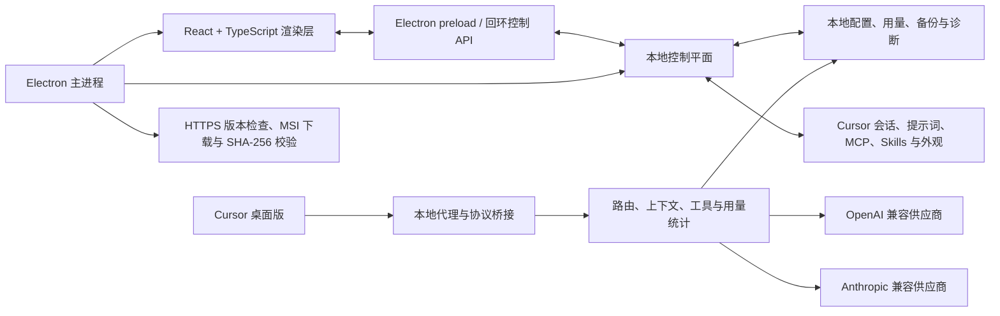

# Cursor Studio

<p align="center">
  
</p>

<p align="center">
  <strong>面向 Cursor 的本地优先 Windows 桌面控制中心。</strong><br>
  在一个应用中管理模型供应商、掌握用量与费用，并维护 Cursor 会话、提示词、MCP、Skills、外观和集成设置。
</p>

<p align="center">
  <a href="README.md">English</a> | <a href="README.zh-CN.md">简体中文</a>
</p>

<p align="center">
  <a href="https://github.com/DearLicy/cursor-studio/releases/latest"></a>
  <a href="https://github.com/DearLicy/cursor-studio/releases/latest"></a>
  
  
  <a href="LICENSE"></a>
</p>

<p align="center">
  <a href="https://github.com/DearLicy/cursor-studio/releases/latest"><strong>下载最新 Windows MSI</strong></a>
</p>

> [!NOTE]
> Cursor Studio 是独立的社区项目，与 Cursor 或 Anysphere 不存在隶属、背书或赞助关系。


## 为什么选择 Cursor Studio？

当模型连接和个人工作流稳定可靠时，Cursor 才能发挥最大价值。Cursor Studio 把这套工作流背后的文件、设置、密钥、用量记录与集成能力整理成清晰一致的桌面体验。

- **一个控制界面：** 供应商、路由、用量、会话、提示词、MCP、Skills、外观、备份与诊断都集中在同一个应用中。
- **对兼容供应商更友好：** 支持 OpenAI 兼容与 Anthropic 兼容服务；OpenAI 供应商可选择 Chat Completions 或 Responses；无需手工修改 Cursor 文件即可拉取模型并测试连接。
- **符合直觉的 Base URL：** `https://www.akucb.com` 和 `https://www.akucb.com/v1` 都能直接使用。Cursor Studio 会规范化末尾的 `/v1`，避免 `/v1/v1/models` 之类的重复路径。
- **余额无需额外账号配置：** 对 New API 与 Sub2API，直接复用供应商已有的 Base URL 和 API Key，自动识别平台并查询余额。
- **透明的费用控制：** 通过模型价格快照和供应商价格倍率，让估算费用贴合中转商或组织的实际定价，同时不影响上游账单。
- **贴合 Cursor 的工作流管理：** 查看本地会话，维护提示词规则，探测 MCP 服务，并从 Cursor 实际使用的位置发现或安装 Skills。
- **本地优先的数据归属：** 配置和用量历史保留在 Windows 用户目录内，无需注册 Cursor Studio 云端账号。
- **改动可恢复：** 内置配置快照、Cursor 设置备份、外观还原、诊断导出与经过校验的 MSI 在线更新。
- **英文与简体中文：** 首次启动默认跟随操作系统；可在窗口控制按钮左侧点击语言图标，从带旗帜的菜单选择“English”或“简体中文”，偏好会自动保存。

## 功能总览

| 区域 | 提供的能力 |
| --- | --- |
| **概览** | 服务状态、请求与 Token 总量、缓存效率、成功率、估算费用、供应商余额摘要、更新状态与社区支持入口。 |
| **供应商** | OpenAI/Anthropic 兼容连接、模型拉取、默认模型、模型启用与收藏、上下文/输出限制、推理强度、逐模型价格、健康检查、故障转移优先级、余额查询和供应商价格倍率。 |
| **用量** | 24 小时、7/30/90 天或全部历史；Token/请求/费用趋势；供应商分布；缓存构成；活跃热力图；模型排行；状态/来源/供应商/模型筛选；请求明细搜索；CSV 导出；本地记录清理。 |
| **会话** | 读取 Cursor 本地会话索引，按最近活动或项目浏览，查看消息，搜索与分页，批量删除会话，并清理空会话及其文件。 |
| **提示词** | 内置与自定义提示词库，支持搜索、复制、编辑、启停、追加/替换注入模式、冲突检测以及同步到 Cursor 托管规则。 |
| **MCP** | 读取和更新 Cursor MCP 配置，导入服务器 JSON，探测 stdio 与 HTTP/SSE 传输，查看发现的工具与探测状态，并删除条目。 |
| **Skills** | 发现全局与工作区 `SKILL.md`，查看或编辑可写 Skill，新建和删除本地 Skill，添加 GitHub 仓库，安装发现的 Skills，并检查已托管安装的更新。 |
| **设置** | 本地路由与代理状态、证书状态、Cursor 连接控制、配置导入导出、最近三份快照备份、诊断导出、外观控制和 Cursor 资料/上下文设置。 |
| **外观** | 图片或视频背景、透明度、模糊、内容表面透明度、尺寸与混合模式、随机目录、定时轮换、实时预览、Cursor 注入和基于备份的还原。 |
| **更新与语言** | 应用内版本检查、下载进度、SHA-256 校验、MSI 安装与重启，首次默认跟随系统，并持久化 English/简体中文偏好。 |

## 安装

### 运行要求

- Windows 10 或 Windows 11，x64
- 如需使用 Cursor 集成、会话、MCP、Skills、提示词和外观功能，需要已安装 Cursor 桌面版
- 模型供应商和可选在线功能需要网络连接，包括版本检查、价格刷新和 GitHub Skill 来源

### 安装发布版本

1. 打开[最新 Release](https://github.com/DearLicy/cursor-studio/releases/latest)。
2. 下载 `Cursor Studio.msi`。
3. 运行安装程序，然后从开始菜单或桌面快捷方式启动 Cursor Studio。

MSI 默认按当前用户安装。部分 Cursor 外观操作会修改 Cursor 安装目录中的文件，因此应用可能提示先退出 Cursor，或使用提升的权限运行 Cursor Studio。

## 快速开始

1. 打开**供应商**页面并新增供应商。
2. 选择 **OpenAI 兼容**或 **Anthropic 兼容**，填写显示名称、Base URL 和 API Key。
3. OpenAI 兼容供应商可选择 **Chat Completions** 或 **Responses**。如果供应商相对模型基础价格存在加价或折扣，请设置价格倍率。
4. 拉取模型列表，启用需要的模型，选择默认模型并保存。
5. 保存供应商；Cursor Studio 会自动识别 New API 或 Sub2API，并在供应商列表显示余额。
6. 打开**设置 > 代理设置**，启动并连接本地服务；如果当前连接流程需要证书，请按界面提示操作。
7. 重新加载或重启 Cursor。经过 Studio 路由的请求会开始出现在**概览**和**用量**页面。

## 供应商配置

### 支持的 API 形态

| 供应商类型 | 请求接口 | 模型发现 |
| --- | --- | --- |
| OpenAI 兼容 | `/v1/chat/completions` 或 `/v1/responses` | `/v1/models`，并兼容回退到 `/models` |
| Anthropic 兼容 | `/v1/messages` | `/v1/models` |

OpenAI 接口选项对该供应商下的全部模型生效。当兼容的 Responses 接口返回 `404` 或 `405` 时，运行时可回退到 Chat Completions 以提高兼容性。

### Base URL 规范化

可以填写部署根地址，也可以在末尾带 `/v1`，以下写法全部支持：

```text
https://www.akucb.com
https://www.akucb.com/
https://www.akucb.com/v1
https://www.akucb.com/v1/
```

这四种写法在平台接口查询时会解析为相同站点根地址，在模型请求时会拼接成正确的版本化路径。地址中的前缀会保留，例如 `https://example.com/gateway/openai/v1` 仍会位于 `/gateway/openai` 下。

请填写 Base URL，不建议填写 `/v1/chat/completions` 这类完整叶子接口。

### New API 与 Sub2API 自动余额

余额查询直接使用供应商中已经保存的 Base URL 和 API Key，不需要另外配置后台 Access Token、用户 ID、余额地址或平台类型。

供应商列表只显示剩余额度。余额会自动加载；手动检测延迟时，也会使用本次检测的 Base URL 和 API Key 同步刷新余额。

Cursor Studio 会依次探测以下带鉴权接口：

| 平台 | 用途 | 接口 |
| --- | --- | --- |
| New API | 识别平台并读取 Token 额度 | `GET {siteRoot}/api/usage/token/` |
| Sub2API | 识别 API Key 计费协议 | `GET {siteRoot}/v1/sub2api/billing` |
| Sub2API | 读取可用/已用额度或不限额状态 | `GET {siteRoot}/v1/usage` |

请求使用 `Authorization: Bearer <API_KEY>`。New API 额度遵循其常用展示换算，即 500,000 quota 对应 1 美元。Sub2API 的 billing 响应用于识别平台，相邻的 usage 响应用于提供最终显示的余额。

余额查询要求服务器实现其中一种兼容响应结构。一个只兼容 OpenAI 模型接口的中转服务可能可以正常对话，但没有可用的余额接口。

### 模型价格与供应商倍率

Cursor Studio 会根据匹配到的模型价格目录，或单个模型中配置的价格估算请求费用，随后在用量页面应用供应商倍率：

桌面应用运行期间，后台监控会每 10 分钟检测一次已启用且配置完整的供应商延迟，并刷新 models.dev 价格目录。定时观察只更新状态，不会累计路由熔断失败次数。

```text
显示费用 = 模型基础估算费用 × 供应商价格倍率
```

示例：

| 倍率 | 含义 |
| ---: | --- |
| `1.00` | 按基础估算显示 |
| `1.25` | 加上 25% 的中转商或组织加价 |
| `0.80` | 应用 20% 折扣 |
| `0` | 该供应商显示为零费用 |

倍率支持任意大于或等于 `0` 的有限数值；无效值或负数会回退为 `1`。倍率仅用于报表展示，不会修改供应商请求、API 参数、账号额度或上游账单。查询用量时会按供应商当前倍率重新计算已保存的记录，因此修改倍率后，与该供应商关联的历史汇总也会更新。

## 用量统计

Cursor Studio 会记录经过本地运行时的请求，并跟踪：

- 输入、输出、缓存读取、缓存写入与总 Token；
- 供应商、模型、请求来源、状态、延迟和错误摘要；
- 估算时使用的价格来源与价格快照；
- 应用供应商倍率后的美元费用。

使用**导出 CSV**可以导出当前日期、供应商、模型与来源筛选结果。清空用量只会删除本地保存的统计与最近请求明细，不会修改供应商侧的账单记录。

费用数据属于估算值。当供应商存在阶梯价格、套餐额度、取整规则，或使用了配置之外的服务端倍率时，应以供应商账单和余额接口为准。

## 本地数据与隐私

Cursor Studio 不要求注册自己的云端账号，应用数据保存在：

```text
%USERPROFILE%\.cursor-studio\
```

主要位置如下：

| 路径 | 内容 |
| --- | --- |
| `~/.cursor-studio/config.yaml` | 供应商、API Key、路由、外观、语言和 Cursor 集成设置 |
| `~/.cursor-studio/history/usage.json` | 本地请求与用量历史 |
| `~/.cursor-studio/backups/` | 最近最多三份配置快照 |
| `~/.cursor-studio/diagnostics/` | 生成的诊断 JSON 包 |
| Cursor 用户/工作区目录 | 各功能页读取或管理的现有 Cursor 会话、MCP 配置、规则与 Skills |

请将 `config.yaml`、配置导出和备份文件视为敏感文件：供应商 API Key 会保存在其中供本地运行时使用。诊断包使用状态和指纹信息代替供应商密钥，但公开分享前仍应检查文件内容。

仅在功能需要时发起网络访问，包括供应商推理、模型发现、健康检查和余额查询，模型价格刷新，GitHub Release 与 Skill 仓库请求，以及可选的首页内容。本地代理和管理服务默认只监听回环地址 `127.0.0.1`。

## 架构



渲染层无需直接访问文件系统。Electron 与本地 Node 服务负责原生操作、供应商路由、Cursor 集成和持久化。这个边界也让大部分控制平面行为可以通过 smoke 测试验证，而无需驱动界面。

## 开发

### 开发环境

- Node.js 20 或更高版本
- npm
- 原生 Cursor 集成与 MSI 打包需要 Windows

### 从源码运行

```powershell
git clone https://github.com/DearLicy/cursor-studio.git
cd cursor-studio
npm ci
npm run dev
```

`npm run dev` 会启动 Vite 和 Electron 开发进程。当前 `npm run dev:ui` 是同一套 Vite 流程的别名；如需连接一个已经运行的开发服务器，可以使用 `npm run dev:electron` 手动启动 Electron。

### 验证改动

```powershell
npm run typecheck
npm run smoke:balance
npm run smoke:provider-monitor
npm run smoke:stage3
npm run smoke:release
npm run smoke:acceptance
npm run build
```

仓库还包含面向供应商、路由、流式响应、历史、提示词、MCP/Skills、会话、诊断和 Cursor 集成的细分 smoke 脚本。完整列表请查看 [`package.json`](package.json) 的 `scripts` 字段。

### 构建 Windows 安装包

```powershell
npm run pack
```

打包流程会构建渲染器和 Electron 进程、创建 x64 MSI、验证 Windows 可执行文件，并清理中间发布文件。最终产物位于 `release/Cursor Studio.msi`。

## 在线更新

安装后的 Windows 版本可以在 Cursor Studio 内检查更新。版本检查具有明确的超时边界，并与可选首页内容相互独立。发现新版本后，Studio 会：

1. 通过 HTTPS 从配置的 GitHub Release 下载 MSI；
2. 显示下载进度；
3. 在提供文件大小时校验大小，并始终校验必需的 SHA-256；
4. 启动当前用户的 MSI 安装流程并重新打开应用。

开发模式下应用内更新会保持停用；源码版本应通过 Git 与 npm 更新。

## 常见问题

| 现象 | 检查方式 |
| --- | --- |
| **没有识别到余额** | 确认 Base URL 与 API Key，然后检查服务是否实现 New API `/api/usage/token/`，或 Sub2API `/v1/sub2api/billing` 与 `/v1/usage`。只兼容模型 API 并不代表同时提供余额 API。 |
| **URL 中出现重复 `/v1`** | 保存站点根地址或仅在末尾保留一个 `/v1`，不要填写完整请求接口；重新保存供应商并再次拉取模型。 |
| **模型拉取失败** | 检查密钥是否具有模型列表权限，以及服务是否开放 `/v1/models` 或 `/models`；运行供应商连接检测查看状态与延迟。 |
| **Cursor 未连接** | 在设置中检查服务状态和回环端口，关闭冲突的本地监听程序，重新连接并重启 Cursor。仅在 Cursor Studio 提示时通过应用安装本地证书。 |
| **外观修改未显示** | 完全退出 Cursor，重新应用外观后再启动。部分安装位置需要提升写入权限；可使用内置的清除/还原操作恢复已备份的 Cursor 文件。 |
| **用量为空** | 只有经过正在运行的 Studio 服务的流量才会记录。确认 Cursor 已连接到 Studio，并且供应商请求到达本地运行时。 |
| **更新检查或安装失败** | 使用已安装版本，确认可以访问 GitHub，并查看界面显示的超时、HTTP、安装包或校验和错误。更新器只接受配置仓库中带 SHA-256 元数据的 HTTPS `.msi` Release 资产。 |
| **界面提示桌面 API 不可用** | 使用 `npm run dev` 启动 Vite/Electron 开发流程，不要只在浏览器中打开渲染器地址；或者重新打开已安装的桌面应用。 |

报告可复现的运行问题时，可使用**设置 > 代理设置 > 导出诊断**。添加附件前请移除个人对话或其他敏感内容。

## 参与贡献

欢迎提交错误报告、范围清晰的改进、翻译与文档修正。

1. 提交前先搜索[现有 Issues](https://github.com/DearLicy/cursor-studio/issues)。
2. 保持改动聚焦，并按行为影响补充相应测试。
3. 运行类型检查、相关 smoke 测试和生产构建。
4. 界面改动请提供复现步骤与截图。

提交 Pull Request 或安全报告前，请阅读 [`CONTRIBUTING.md`](CONTRIBUTING.md)、[`CODE_OF_CONDUCT.md`](CODE_OF_CONDUCT.md) 与 [`SECURITY.md`](SECURITY.md)。

## 社区与支持

- 使用问题与想法：[GitHub Discussions](https://github.com/DearLicy/cursor-studio/discussions)
- 可复现问题：[GitHub Issues](https://github.com/DearLicy/cursor-studio/issues)
- 版本下载：[GitHub Releases](https://github.com/DearLicy/cursor-studio/releases)

如果 Cursor Studio 帮你节省了时间，可以支持项目继续维护：

<table>
  <tr>
    <td align="center">
      <strong>微信</strong><br>
      
    </td>
    <td align="center">
      <strong>支付宝</strong><br>
      
    </td>
  </tr>
</table>

**USDT（TRC20）**

```text
TKu7SNWrmi3n1n6e8FJDgPAwe8oGrxXHvP
```

## 许可证

Cursor Studio 基于 [MIT License](LICENSE) 发布。
